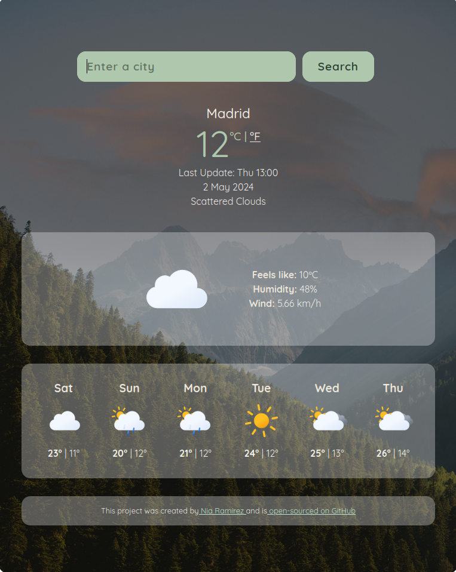

# React Weather App

This is a simple React Weather App that allows users to check the current weather, the conditions and the forecast for a given location. It uses the SheCodes Weather API to get the weather data.

## Installation
1. Clone the repository: git clone `https://github.com/yourusername/react-weather-app.git`
2. Go to the project directory: cd react-weather-app
3. Install dependencies: npm install
4. See the env.sample file to create a .env file with the API key
5. Start the development server: npm start
    

If you want to use the app, go to this [link](https://react-weather-engine.netlify.app/) and enter a city name in the search bar. The app will display the current weather, the conditions and the forecast for the next 6 days.

